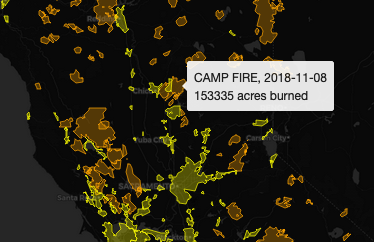

# Introduction to Digital Mapping with Leaflet
Online tutorials for Leaflet Web Mapping

## Contents

- [Lesson 1: Finding and Wrangling Data, Basic Web Map Code Structure, Open Source Base Maps](#lesson-1-finding-and-wrangling-data-basic-web-map-code-structure-open-source-base-maps)
  - [The Basic Components of a Leaflet Web Map](#the-basic-components-of-a-leaflet-web-map)
  - [Finding and Wrangling Data](#finding-and-wrangling-data)
  - [Basic Web Map Coding](#basic-web-map-coding)
  - [Open Source Base Maps](#open-source-base-maps)
  - [Lesson 1 Recap](#lesson-1-recap)
- [Lesson 2: Loading and Styling Data in a Leaflet Web Map](#lesson-2-loading-and-styling-data-in-a-leaflet-web-map)
  - [Using jQuery Ajax Methods to Load Data](#using-jquery-ajax-methods-to-load-data)
  - [Using the Web Console to Develop and Debug Maps with Live Server](#using-the-web-console-to-develop-and-debug-maps-with-live-server)
  - [Layer Styling in Leaflet](#layer-styling-in-leaflet)
  - [Adding Interactive Tooltip Content](#adding-interactive-tooltip-content)
  - [Lesson 2 Recap](#lesson-2-recap)
- [Lesson 3: Adding a Time Slider and Temporal Legend to Update the Data by Time](#lesson-3-adding-a-time-slider-and-temporal-legend-to-update-the-data-by-time)
  - [Adding a Time Slider](#adding-a-time-slider)
  - [Retrieving the Time Slider Inputs with JavaScript](#retrieving-the-time-slider-inputs-with-javascript)
  - [Adding a Temporal Legend](#adding-a-temporal-legend)
  - [Lesson 3 Recap](#lesson-3-recap)
- [Lesson 4: Write a Function to Update the Data with the Time Slider](#lesson-4-write-a-function-to-update-the-data-with-the-time-slider)
  - [Initialize a Data Update Function to Handle Years Selected and Wildfire Data](#initialize-a-data-update-function-to-handle-years-selected-and-wildfire-data)
  - [Editing the Function to Make the Time Slider Update the Wildfire Data](#editing-the-function-to-make-the-time-slider-update-the-wildfire-data)
  - [Finalizing the City Layer](#finalizing-the-city-layer)
  - [Adding a Title and Scale Bar (and a More In-Depth Look at CSS)](#adding-a-title-and-scale-bar-and-a-more-in-depth-look-at-css)
  - [Lesson 4 Recap](#lesson-4-recap)
- [Lesson 5: Add an Analytical Line Graph and Publish Map With GitHub](#lesson-5-add-an-analytical-line-graph-and-publish-map-with-github)
  - [Wrangling the Data for the Graph](#wrangling-the-data-for-the-graph)
  - [Building the Graph](#building-the-graph)
  - [Setting Up a GitHub Account and Creating a Repository for Your Project](#setting-up-a-github-account-and-creating-a-repository-for-your-project)
  - [Publishing Your Map](#publishing-your-map)
  - [Lesson 5 Recap](#lesson-5-recap)

## Lesson 1: Finding and Wrangling Data, Basic Web Map Code Structure, Open Source Base Maps
In this class, we will explore the [Leaflet JavaScript](https://leafletjs.com/) library for making interactive online maps. While it will help, there is no expectation that you be familiar with JavaScript or be able to write JavaScript from memory as a consequence of this class. This class is meant to familiarize yourself with learning how to use various web-based resources (including the tutorials presented here) to modify and apply Leaflet JavaScript to deploy an online map that you can host from GitHub and share with others.

### The Basic Components of a Leaflet Web Map
Every map will start with an html file, here called "index.html". Inside this file, you will include the HTML (Hypertext Markup Language) template code that tells the web browser how to display your map. You will copy and paste this in your own index.html file at a later step. Within this file, you will also include the CSS (Cascading Style Sheets) code that allows you to customize the appearance of elements included in your web map. CSS gives you artistic license over stylistic aspects of your web map. Finally, you will also write the Leaflet JavaScript within the index.html file. Leaflet is a JavaScript library that allows you to build web mapping applications. It is not the only one, but perhaps the most comprehensive. Mapbox GL JS is another good one, for example.

  
**Figure 01**. The folder structure of a web map.

In the image above, you will notice there are a few more files and subdirectories. You will replicate this folder structure. First, you will notice a data folder with some JSON (JavaScript Object Notation) files. If you have used ArcGIS, you might be familiar with ESRI Shapefiles. However, because we are now mapping in JavaScript, we need our geographical data in JSON/GeoJSON format. In the image above the JSON files correspond to polygons representing California cities and areas burned by wildfires in California over the last decade.

Next, you will notice a js folder. This folder contains a supplementary JavaScript library called [Simple Statistics](https://simplestatistics.org/). Whereas Leaflet is specifically for geovisualization, this JavaScript library performs statistical analysis. There are many JavaScript libraries you can take advantage of to assist with data visualization, and we will take a quick look at a few during this course.

Also, you will see a file called README.md. In this case, this is a Markdown file that provides some brief explanatory text about your map for other GitHub users. It is not necessary, but you will see how it can help others evaluate and use your data in the open source GitHub environment.

Finally, you are probably wondering what all of this GitHub stuff is. [GitHub](https://github.com/) is an IT service management company that provides hosting for developers. In this class, we will use it to host our files and publish our map.

### Finding and Wrangling Data
By now, you have probably figured out that we will be mapping California wildfires and their proximity to urban areas over the last decade. Where can we download this data? Usually, I simply search Google for some reputable data sources. In this case, I have done the searching for you.

Before downloading any data, set up your project folder as follows. Make a new folder on your desktop called "california-fires" and, inside of it, create a folder called "data" for the data you will download. Create another folder called "js" for the Simple Statistics JavaScript library. It should look as follows:

  
**Figure 02**. Initial folder structure.

At [ArcGIS Hub](https://hub.arcgis.com/datasets/653647b20bc74480b335e31d6d81a52f/data?geometry=-151.022%2C31.426%2C-87.741%2C43.578&layer=1&orderBy=YEAR_&orderByAsc=false), you can find polygons delimiting all burned areas in California for the 2010s. Go ahead and click the link above. Then select Download >> Shapefile under "Full Dataset" as shown below.

  
**Figure 03**. Downloading the California wildfire data.

In your downloads folder, you will now see the shapefile containing the data. However, as described above, this is the wrong data format for JavaScript web mapping. We need this in JSON (JavaScript Object Notation) format. What to do?

[Mapshaper](https://mapshaper.org/) by [Matthew Bloch](https://www.nytimes.com/by/matthew-bloch) at the New York Times is a great way to quickly check and edit your geographic data without downloading and installing any GIS software. We can do a lot of neat things with this convenient web resource, including querying the data, simplifying it to reduce size, and exporting to other formats. Go ahead and drag the zipped shapefile into the empty window in Mapshaper and click "Import". You should now see the outlines of all the wildfires in the window. Query the polygons to see what kind of information is included with each polygon. Next, simplify the data to 5%, using the Douglas-Peucker algorithm. Then, repair the line intersections. From the options at the top right, click Export >> GeoJSON >> Export as shown below.

  
**Figure 04**. Using Mapshaper to export the California wildfire data to a JSON file.

Make sure to save the exported JSON file in your "data" folder.

  
**Figure 05**. Inside the data folder.

Now, we need the urban area boundaries. These can be found at [UC Berkeley Library's Geodata](https://geodata.lib.berkeley.edu/catalog/stanford-jt346pj7452) site. In this case, we have an option to export a GeoJSON file directly without needing to convert. As shown below, click the "Export" button next to "GeoJSON". Immediately, an announcement should appear at the top of the page saying that your file is ready for download. Click that and check your download folder.

  
**Figure 06**. Downloading the urban area boundaries.

Rename this file "California_Urban.json" and drop it into your "data" folder.

  
**Figure 07**. Inside the data folder.

### Basic Web Map Coding

Now that we have our data, it is time to take an initial look at how Leaflet JavaScript works to build an interactive web map application. For this, we will need a good text editor to view and adapt the code to serve our needs. [Atom](https://atom.io/) is free and will serve our needs nicely. Go ahead and download it from the website linked above.

Once you have Atom installed, you will need a way to check your map-building progress as you edit your code (this will make sense later). You can do this with an Atom package called "atom-live-server". Open Atom and, from the bar at the top of the screen, select Atom >> Preferences or hold command + , to open Atom Preferences. From the options at the left, click "Install" and type "atom-live-server" into the search bar. Install the package.

  
**Figure 08**. Installing Atom Live Server.

Once you have done that, you can create your first html file with Atom. From the options at the bar at the top, click File >> New File or hold command + N. In this new document, copy and paste the following web map template code:

```html
<!DOCTYPE html>

<html lang="en">

<head>
  <meta charset="utf-8" />
  <!-- Give the page a title -->
  <title>California Wildfires</title>
  <!-- Add a link to the Leaflet CSS library so you can reference it for styling your map -->
  <link rel="stylesheet" href="https://unpkg.com/leaflet@1.6.0/dist/leaflet.css" />
  <!-- All the CSS code goes inside the style tags below -->
  <style>
    /* style the body */
    body {
      margin: 0px;
      height: 100%;
      width: 100%;
    }

    /* style the map */
    #map {
      position: absolute;
      width: 100%;
      top: 0px;
      bottom: 0;
    }
  </style>
</head>

<body>
  <!-- the map -->
  <div id="map"></div>
  <!-- Add a link to the Leaflet JavaScript library so you can reference it for building your map -->
  <script src="https://unpkg.com/leaflet@1.6.0/dist/leaflet.js"></script>
  <!-- All JavaScript goes inside the script tags below -->
  <script>
    // define map options
    const mapOptions = {
      zoomSnap: 0.5,  // this allows fractional zooming
      center: [37.5, -120], // center the map on the coordinates for California
      zoom: 6.5, // set the initial zoom
    };

    // define the map with the options above
    const map = L.map("map", mapOptions);

    // add a base map to the map
    L.tileLayer('https://{s}.tile.openstreetmap.org/{z}/{x}/{y}.png', {
    	maxZoom: 19,
    	attribution: '&copy; <a href="https://www.openstreetmap.org/copyright">OpenStreetMap</a> contributors'
    }).addTo(map);
  </script>
</body>

</html>
```

Now save this file as "index.html" in your "california-fires" project folder. Don't worry about understanding every line or memorizing the code. Just read through the comments that I have included with the code so that you can get familiar with being able to copy, adapt, and use code snippets to make your map work. After you save this index.html file, close Atom and open the entire "california-fires" project folder in a new Atom session. Click open index.html in Atom. Your screen should look like this:

  
**Figure 09**. Opening the map project with Atom.

Now, from the options at the top, navigate to Packages >> atom-live-server >> Start server. Upon opening your web browser, you should see a locally served map of California that looks like this:

  
**Figure 10**. The initial map in Atom Live Server.

To explain a little about what is happening here, take a look at the lines of code in the index.html file above. Towards the top, you have included a link to the Leaflet CSS library, so that you can use it to style your web map. Within the style tags, you have included some code that tells the page to fill the entire body of the page with the map. You could edit those map parameters and check the effects in live server if you want to understand more. We will be expanding upon this code later. Below that, within the body tags, you have specifically added the map to the body within a div, or container. Then, you have included a link to the Leaflet JavaScript library so that you can use it to build your web map. All of this code goes within the script tags beneath the link. Notice that you have defined the center of the map with coordinates (37.5, -120). These coordinates are in the center of the State of California. You can change these numbers and see how the map will move to a new location on the Earth. You also define the map (const map) using the mapOptions parameters above it.

### Open Source Base Maps

Finally, you have defined a base map with L.tileLayer. At [this site](https://leaflet-extras.github.io/leaflet-providers/preview/), Leaflet provides many other options for free base maps that you can use. Let's change the base map now. Go ahead and swap out:

```js
// add a base map to the map
L.tileLayer('https://{s}.tile.openstreetmap.org/{z}/{x}/{y}.png', {
  maxZoom: 19,
  attribution: '&copy; <a href="https://www.openstreetmap.org/copyright">OpenStreetMap</a> contributors'
}).addTo(map);
```

for:

```js
// add a base map to the map
L.tileLayer('https://{s}.basemaps.cartocdn.com/dark_all/{z}/{x}/{y}{r}.png', {
  attribution: '&copy; <a href="https://www.openstreetmap.org/copyright">OpenStreetMap</a> contributors &copy; <a href="https://carto.com/attributions">CARTO</a>',
  subdomains: 'abcd',
  maxZoom: 20
}).addTo(map);
```

This gives the map a dark base map that minimizes the visual clutter so that we can bring our data to the foreground. When you make your own maps, you will want to think carefully about how your base map choice with work or clash with your data and choose appropriately. Now your map should look like this:

  
**Figure 11**. Changing the base map.

### Lesson 1 Recap

This concludes the first lesson. By the end of this lesson, you should be familiar with finding and downloading geospatial data, converting these data into JSON format and reducing the file size using Mapshaper, organizing your project folder for web mapping, using Atom text editor for setting up a basic index template with HTML, Leaflet CSS, and Leaflet JavaScript in order to produce an initial web map, checking edits with Atom Live Server, centering the map on a specific geographic area using coordinates and zoom settings, and implementing different base maps with Leaflet JavaScript. These first steps are giant steps, so you might want to return to the beginning and review everything one more time to help it settle!

## Lesson 2: Loading and Styling Data in a Leaflet Web Map

Last time, we explored editing some basic Leaflet JavaScript in Atom to run a base map over the web. This time, we will be building out from this foundation, and you will learn how to add and style your GeoJSON data for effective geographic data visualization.

### Using jQuery Ajax Methods to Load Data

To help us do this more easily, we will get some assistance from a JavaScript library called [jQuery](https://jquery.com/). This library allows us to use ajax methods to load our data, which you can identify in the scripts starting with $. To add this library to your project, open your project in Atom and link to the jQuery library just below the link to the Leaflet JavaScript library in your index.html file.

```html
<!-- Add a link to the Leaflet JavaScript library so you can reference it for building your map -->
<script src="https://unpkg.com/leaflet@1.6.0/dist/leaflet.js"></script>
<!-- Add a link to the jQuery JavaScript library so you can leverage ajax methods to load your data -->
<script src="https://cdnjs.cloudflare.com/ajax/libs/jquery/3.5.1/jquery.min.js"></script>
```

Now you are able to use ajax methods to bring your JSON files into your web map. Just beneath the JavaScript that adds your base map to you web map, add the ajax requests like so:

```js
// add a base map to the map
L.tileLayer('https://{s}.basemaps.cartocdn.com/dark_all/{z}/{x}/{y}{r}.png', {
  attribution: '&copy; <a href="https://www.openstreetmap.org/copyright">OpenStreetMap</a> contributors &copy; <a href="https://carto.com/attributions">CARTO</a>',
  subdomains: 'abcd',
  maxZoom: 20
}).addTo(map);

// use jquery to load wildfires GeoJSON data
$.when(
  $.getJSON("data/California_Fire_Perimeters.json"),
  $.getJSON("data/California_Urban.json"),
// when the files are done loading,
// identify them with names and process them through a function  
).done(function(caliFires, caliCities) {
  // write code to do something with the data here
});
```

### Using the Web Console to Develop and Debug Maps with Live Server

Next, we need to check that our data files are indeed accessible and that there are no errors. For this, we can use a handy tool called Web Console. Open your project in your web browser using Atom Live Server. I am using Firefox, so the following instructions for accessing Web Console will apply for Firefox. If you are using something else, run a search with Google for how to access Web Console for your web browser. First, locate Web Developer Tools at the top right of your screen as follows:

  
**Figure 12**. Locating Web Developer Tools.

Click on Web Developer and select Web Console from the tool bar.

  
**Figure 13**. Locating Web Console.

The console should now appear beneath your web map in your browser window. If there are any errors in your coding, you will be able to see the warnings here and find clues for debugging your code. Now, let's run a command to test if our data is accessible. Replace the commented out code "write code to do something with the data here" with the following:

```js
// use jquery to load wildfires GeoJSON data
$.when(
  $.getJSON("data/California_Fire_Perimeters.json"),
  $.getJSON("data/California_Urban.json"),
// when the files are done loading,
// identify them with names and process them through a function  
).done(function(caliFires, caliCities) {
  // log the data to Web Console
  console.log(caliFires);
  console.log(caliCities);
});
```

If all goes well, you should see the following in your console:

  
**Figure 14**. Logging data to the console.

If you expand the logged content by clicking the triangles in the console, you can see the data contained within the loaded files and their properties.

  
**Figure 15**. Viewing data properties in the console.

Before we try to use these properties to style our map data, we need to figure out how to add this content to the map so that we can see it. Replace the console.log commands in your JavaScript with these:

```js
// use jquery to load wildfires GeoJSON data
$.when(
  $.getJSON("data/California_Fire_Perimeters.json"),
  $.getJSON("data/California_Urban.json"),
// when the files are done loading,
// identify them with names and process them through a function  
).done(function(caliFires, caliCities) {
  // initiate a leaflet GeoJSON layer with L.geoJson, feed it the wildfires data, and add to the map
  const wildfires = L.geoJson(caliFires).addTo(map);
  // initiate a leaflet GeoJSON layer with L.geoJson, feed it the urban boundaries data, and add to the map
  const urban = L.geoJson(caliCities).addTo(map);
});
```

Save and refresh. Now, when you look at your map, you should see all the polygons represented with thick blue lines. What did we just do? Within the function, we used a method (L.geoJson) from the Leaflet library to access the GeoJSON data and then we added it to the map with ".addTo(map)". We also defined the files with constants so that we can access the data in later scripts within the document. Returning to the map, it is nice to see your data, but it is not easy to make sense of it. Let's see what we can do to start making this legible.

  
**Figure 16**. Initial visualization of the data.

### Layer Styling in Leaflet

First, let's style these polygons so that the wildfires appear orange and the urban areas appear yellow. Change the code above to the following:

```js
// use jquery to load wildfires GeoJSON data
$.when(
  $.getJSON("data/California_Fire_Perimeters.json"),
  $.getJSON("data/California_Urban.json"),
// when the files are done loading,
// identify them with names and process them through a function  
).done(function(caliFires, caliCities) {
  // initiate a leaflet GeoJSON layer with L.geoJson, feed it the wildfires data, and add to the map
  const wildfires = L.geoJson(caliFires, {
    // style the layer
    style: function(feature) {
      return {
        fillColor: "orange", // set the polygon fill to orange
        fillOpacity: 0.3, // give the polygon fill a 30% opacity
        color: "orange", // set the outline color to orange
        weight: 1.2, // give the outline a weight
        opacity: 0.7 // give the outline 70% opacity
      };
    }
  }).addTo(map);
  // initiate a leaflet GeoJSON layer with L.geoJson, feed it the urban boundaries data, and add to the map
  const urban = L.geoJson(caliCities, {
    // style the layer
    style: function(feature) {
      return {
        fillColor: "yellow", // set the polygon fill to yellow
        fillOpacity: 0.3, // give the polygon fill a 30% opacity
        color: "yellow", // set the outline color to yellow
        weight: 1.0, // give the outline a weight
        opacity: 0.7 // give the outline 70% opacity
      };
    }
  }).addTo(map);
});
```

After saving your code and refreshing your map in live server, you should now see the two datasets symbolized in your map with different colors. This map is starting to make more sense. For you own practice, try swapping out the colors for other colors. You can type the names of new colors or, for a wider range of shades, you can use [hex color codes](https://htmlcolorcodes.com/) within the quotation marks (ex: "orange" --> "#33ffac") and see what happens. Switch the colors back to orange and yellow.

  
**Figure 17**. Visualizing the data by source file.

### Adding Interactive Tooltip Content

Now, let's add a bit of user interaction. If you move your cursor across the map, you will notice that it changes as you hover over a polygon. Using Leaflet, we can make popup content appear to tell us more about each feature when we hover over them. We will need to return to console logging to determine what sort of information we might be able to add, as well as to test our code as we go. But first, we need to add a block of code after each segment pertaining to the style of our layers. Add the following "onEachFeature" block to your ongoing layer edits:

```js
// use jquery to load wildfires GeoJSON data
$.when(
  $.getJSON("data/California_Fire_Perimeters.json"),
  $.getJSON("data/California_Urban.json"),
// when the files are done loading,
// identify them with names and process them through a function  
).done(function(caliFires, caliCities) {
  // initiate a leaflet GeoJSON layer with L.geoJson, feed it the wildfires data, and add to the map
  const wildfires = L.geoJson(caliFires, {
    // style the layer
    style: function(feature) {
      return {
        fillColor: "orange", // set the polygon fill to orange
        fillOpacity: 0.3, // give the polygon fill a 30% opacity
        color: "orange", // set the outline color to orange
        weight: 1.2, // give the outline a weight
        opacity: 0.7 // give the outline 70% opacity
      };
    },
    // for each feature...
    onEachFeature: function(feature, layer) {
      // log the properties to the web console
      console.log(layer.feature.properties);
    }
  }).addTo(map);
  // initiate a leaflet GeoJSON layer with L.geoJson, feed it the urban boundaries data, and add to the map
  const urban = L.geoJson(caliCities, {
    // style the layer
    style: function(feature) {
      return {
        fillColor: "yellow", // set the polygon fill to yellow
        fillOpacity: 0.3, // give the polygon fill a 30% opacity
        color: "yellow", // set the outline color to yellow
        weight: 1.0, // give the outline a weight
        opacity: 0.7 // give the outline 70% opacity
      };
    },
    // for each feature...
    onEachFeature: function(feature, layer) {
      // log the properties to the web console
      console.log(layer.feature.properties);
    }
  }).addTo(map);
});
```

Save these edits and open Web Console on your live served map. Notice how you can now see all of the feature properties logged in Web Console for every polygon on the map.

  
**Figure 18**. Logging feature properties in Web Console.

In the console, you can see the names of each property along with the stored value for that property. We might imagine that someone using our map would like to be able to see the name of each city (name10) upon hovering over urban areas, as well as to see the name (FIRE_NAME), date (ALARM_DATE), and acres (GIS_ACRES) burned for each of the wildfire polygons on the map. Before we try to bind this information to a tooltip, try editing the console logs to the following:

```js
// use jquery to load wildfires GeoJSON data
$.when(
  $.getJSON("data/California_Fire_Perimeters.json"),
  $.getJSON("data/California_Urban.json"),
// when the files are done loading,
// identify them with names and process them through a function  
).done(function(caliFires, caliCities) {
  // initiate a leaflet GeoJSON layer with L.geoJson, feed it the wildfires data, and add to the map
  const wildfires = L.geoJson(caliFires, {
    // style the layer
    style: function(feature) {
      return {
        fillColor: "orange", // set the polygon fill to orange
        fillOpacity: 0.3, // give the polygon fill a 30% opacity
        color: "orange", // set the outline color to orange
        weight: 1.2, // give the outline a weight
        opacity: 0.7 // give the outline 70% opacity
      };
    },
    // for each feature...
    onEachFeature: function(feature, layer) {
      // log the properties to the web console
      console.log(layer.feature.properties.FIRE_NAME + " FIRE, " + layer.feature.properties.ALARM_DATE + "<br>" + layer.feature.properties.GIS_ACRES + " acres burned");
    }
  }).addTo(map);
  // initiate a leaflet GeoJSON layer with L.geoJson, feed it the urban boundaries data, and add to the map
  const urban = L.geoJson(caliCities, {
    // style the layer
    style: function(feature) {
      return {
        fillColor: "yellow", // set the polygon fill to yellow
        fillOpacity: 0.3, // give the polygon fill a 30% opacity
        color: "yellow", // set the outline color to yellow
        weight: 1.0, // give the outline a weight
        opacity: 0.7 // give the outline 70% opacity
      };
    },
    // for each feature...
    onEachFeature: function(feature, layer) {
      // log the properties to the web console
      console.log(layer.feature.properties.name10);
    }
  }).addTo(map);
});
```

Save, refresh the map, and check the console.

  
**Figure 19**. Customizing feature properties in Web Console.

The city names look ready to add to a tooltip, but the wildfire info will need some more work. First, the temporal data is too fine. Users probably don't need to see all of those hour, minute, and second zeroes. Second, the acreage data is also too fine. We can get away with a rounded figure with no decimal places. Let's edit the wildfire console log to the following:

```js
// for each feature...
onEachFeature: function(feature, layer) {
  // log the properties to the web console
  console.log(layer.feature.properties.FIRE_NAME + " FIRE, " + layer.feature.properties.ALARM_DATE.substring(0, 10) + "<br>" + parseInt(layer.feature.properties.GIS_ACRES) + " acres burned");
}
```

Your logged wildfire data should now look like this in your console:

  
**Figure 20**. Final wildfire data in Web Console.

That looks good, but what exactly did we do? The code segment ".substring(0,10)" retrieved only the first 10 characters from each date, removing the time content. Meanwhile "parseInt()" took the acreage and parsed it as an integer, instead of as a real number, thereby deleting the decimal places.

Now that this information is properly formatted for an interactive tooltip element, it's time to add some new code to each layer. In order to add tooltip content to your layers, update your layer code as follows, using "layer.bindTooltip":

```js
// use jquery to load wildfires GeoJSON data
$.when(
  $.getJSON("data/California_Fire_Perimeters.json"),
  $.getJSON("data/California_Urban.json"),
// when the files are done loading,
// identify them with names and process them through a function
).done(function(caliFires, caliCities) {
  // initiate a leaflet GeoJSON layer with L.geoJson, feed it the wildfires data, and add to the map
  const wildfires = L.geoJson(caliFires, {
    // style the layer
    style: function(feature) {
      return {
        fillColor: "orange", // set the polygon fill to orange
        fillOpacity: 0.3, // give the polygon fill a 30% opacity
        color: "orange", // set the outline color to orange
        weight: 1.2, // give the outline a weight
        opacity: 0.7 // give the outline 70% opacity
      };
    },
    // for each feature...
    onEachFeature: function(feature, layer) {
      // define the tooltip info
      let wildfireTooltip = layer.feature.properties.FIRE_NAME + " FIRE, " + layer.feature.properties.ALARM_DATE.substring(0, 10) + "<br>" + parseInt(layer.feature.properties.GIS_ACRES) + " acres burned";
      // bind the tooltip to the layer and add the content defined as "wildfireTooltip" above
      layer.bindTooltip(wildfireTooltip, {
        sticky: true,
        className: "tooltip",
      });
    }
  }).addTo(map);
  // initiate a leaflet GeoJSON layer with L.geoJson, feed it the urban boundaries data, and add to the map
  const urban = L.geoJson(caliCities, {
    // style the layer
    style: function(feature) {
      return {
        fillColor: "yellow", // set the polygon fill to yellow
        fillOpacity: 0.3, // give the polygon fill a 30% opacity
        color: "yellow", // set the outline color to yellow
        weight: 1.0, // give the outline a weight
        opacity: 0.7 // give the outline 70% opacity
      };
    },
    // for each feature...
    onEachFeature: function(feature, layer) {
      // define the tooltip info
      let cityTooltip = layer.feature.properties.name10;
      // bind the tooltip to the layer and add the content defined as "cityTooltip" above
      layer.bindTooltip(cityTooltip, {
        sticky: true,
        className: "tooltip",
      });
    }
  }).addTo(map);
});
```

After saving and refreshing, you should now see informative tooltip content when you hover over your map layers.

  
**Figure 21**. Interactive tooltip content.

### Lesson 2 Recap

In this lesson, we learned how to load GeoJSON data with jQuery ajax methods to visualize it on a web map. We took a look at using the web console to develop and debug maps with Atom Live Server. We examined how to style a polygon inside a Leaflet GeoJSON layer and looked at hex codes for coloring. Finally, we introduced some basic user interaction by adding layer tooltip content and using console logs to query the GeoJSON file structure and to access its internal data.

## Lesson 3: Adding a Time Slider and Temporal Legend to Update the Data by Time

When we added the tooltip content to our map, we noticed that each wildfire had a time stamp. It would be nice if we could filter our data to display wildfires by year so that we can compare acres burned annually and see if we can discern any trend over the last decade. As it happens, there is a way to filter the visibility of our wildfire data with an interactive time slider element and we will see how to make one in this lesson.

### Adding a Time Slider

First, let's add a time slider. This will require coding a new div into our page. Open the map project in Atom and open the index.html file. Within the <body> tags of your HTML code, you will insert a new div we will call "slider" just beneath the one called "map".

```html
<!-- the map -->
<div id="map"></div>
<!-- ui slider -->
<div id="slider" class="leaflet-control">
  <!-- Use the first and last year of the time data as the min and max. Set the initial value as the first year. Set the steps at one year. -->
  <input type="range" min="2010" max="2019" value="2010" step="1" class="slider" />
</div>
```

We give ids to these divs so that we can reference them in our CSS and JavaScript scripting. Also, you will notice that we have defined the input as a range of values from 2010 to 2019 with increments (steps) of 1. These correspond to the range of years covered by our wildfire data. If you save these edits and refresh your map in live server, you might notice a rudimentary slider element lurking in the upper left corner behind the zoom controls. We need to add some CSS code to improve upon the appearance and to reposition it. Within the <style> tags of your HTML code, include some CSS code for the slider just beneath the CSS that styles the map.

```css
/* the map */
#map {
  position: absolute;
  width: 100%;
  top: 0px;
  bottom: 0;
}

/* Set time slider styles */
#slider {
  position: absolute;
  height: 25px;
  bottom: 10px;
  left: 125px;
  z-index: 1000;
  background-color: #FFFFFF;
  border-radius: 3px;
  box-shadow: 0px 0px 0px 2px rgba(0, 0, 0, 0.3);
}
```

Notice that you referenced the slider element using its div id by typing "#slider", just as you did for the map in the CSS above it. Within the curly brackets, you fed the script some details about where the slider should be located and how it should appear. Feel free to fiddle around with these settings so that you can understand what these options do. You can also research other CSS options you can use by searching online. Now, if you save your code and refresh your map, you should see a fully styled slider in the bottom left corner of your map. We have not yet added a temporal legend, nor have we added any code to make this slider talk to our wildfire data. You can move the slider, but it doesn't do anything!

### Retrieving the Time Slider Inputs with JavaScript

The first thing we need to do in order to make the time slider work with the data is to add some JavaScript to retrieve the year from the time slider. Though it may not look like it is doing anything, every time you move the time slider, the position corresponds to a year in the range you fed it with your HTML code. We need to get that year.

To do this, we need to write a function. This function will go just beneath the semicolon ending the function that processes our JSON data and we will call it "sequenceUI". Know that you could call the function anything you want, as long as you remain consistent when calling it. Copy and paste the following function just beneath the semicolon ending the function that processes our JSON data and just before the closing </script> tag.

```js
// call the UI slider with a function called "sequenceUI"
function sequenceUI(wildfires) { // feed it the wildfires data

  // use the jQuery ajax method to get the slider element
  $('.slider')
    .on('input change', function() { // when the input changes...
      let currentYear = $(this).val(); // identify the year selected with "currentYear"
    });

}; // End sequenceUI function
```

Notice that, in defining this function, you have fed it the wildfires data with "function sequenceUI(wildfires)". This is because you want the time slider to interact with this data. However, there is one more step needed to feed this data to this function. At this time, this function can't actually read this data because it is contained within the function above it. Therefore, we need to call the new "sequenceUI" function within the function above it, which contains and processes the wildfire data.

```js
  }).addTo(map);

  // call functions defined below
  sequenceUI(wildfires); // calls the time slider and sends the layer to it
});
```

Now, let's make sure everything is working properly. Open the web console on live server, return to the index.html file and include the following console log command in your "sequenceUI" function:

```js
// use the jQuery ajax method to get the slider element
$('.slider')
  .on('input change', function() { // when the input changes...
    let currentYear = $(this).val(); // identify the year selected with "currentYear"
    console.log(currentYear); // log the selected year to the console
  });
```

Save your code and refresh your map. If you have your web console open, you should notice it logging the year every time you change the position of your time slider.


**Figure 22**. Logging time slider inputs in the web console.

It's nice to see that data in the console, but we need a casual map user to be able to see it on the map as they interact with the slider. We need to write a similar set of code to make a temporal legend that interacts with the time slider.

### Adding a Temporal Legend

In order to add a temporal legend, the first thing we need to do is to add another div to our HTML code just beneath that which added the time slider.

```html
<!-- the map -->
<div id="map"></div>
<!-- ui slider -->
<div id="slider" class="leaflet-control">
  <!-- Use the first and last year of the time data as the min and max. Set the initial value as the first year. Set the steps at one year. -->
  <input type="range" min="2010" max="2019" value="2010" step="1" class="slider" />
</div>
<!-- temporal legend -->
<div id='temporal'>
  <h5 class='txt-bold'><span></span></h5>
</div>
```

This will not result in any visible changes to your map, so don't worry if everything looks the same after saving and refreshing. Now, we need to add some CSS to style the temporal legend. Add this code just below the CSS for the time slider.

```css
/* Set time slider styles */
#slider {
  position: absolute;
  height: 25px;
  bottom: 10px;
  left: 125px;
  z-index: 1000;
  background-color: #FFFFFF;
  border-radius: 3px;
  box-shadow: 0px 0px 0px 2px rgba(0, 0, 0, 0.3);
}

/* Set temporal legend styles */
#temporal {
  height: 25px;
  width: 86px;
  background-color: #FFFFFF;
  border-radius: 3px;
  box-shadow: 0px 0px 0px 2px rgba(0, 0, 0, 0.3);
}

/* Set the styles for the text span in the temporal legend */
#temporal span {
  font-family: 'Montserrat', sans-serif;
  position: absolute;
  font-size: 13px;
  bottom: 2px;
  left: 10px;
}
```

Notice that we have added two blocks of CSS code. The first one is for the legend itself, while the second one pertains to the text within the legend, which will display the selected year. Again, after saving and refreshing, you will not notice any changes to your map. We need to define and add a new function to add the legend to the map and get it to interact with the time slider.

Let's call this new function "createTemporalLegend" and define what it does right after the "sequenceUI" function. We want the temporal legend to display the year selected by the time slider, so we will feed this function the "currentYear" value. The function should be written as follows:

```js
// call the UI slider with a function called "sequenceUI"
function sequenceUI(wildfires) { // feed it the wildfires data

  // use the jQuery ajax method to get the slider element
  $('.slider')
    .on('input change', function() { // when the input changes...
      let currentYear = $(this).val(); // identify the year selected with "currentYear"
      console.log(currentYear); // log the selected year to the console
    });

}; // End sequenceUI function

// Add a temporal legend in sync with the UI slider
function createTemporalLegend(currentYear) { // feed it the selected year

  // define the temporal legend with a Leaflet control
  const temporalLegend = L.control({
    position: 'bottomleft' // place the temporal legend at bottom left corner
  });

  // when added to the map
  temporalLegend.onAdd = function(map) {

    const div = L.DomUtil.get("temporal"); // get the div

    // disable the mouse events
    L.DomEvent.addListener(div, 'mousedown', function(e) {
      L.DomEvent.stopPropagation(e);
    });

    return div; // return the div from the function

  }

  $('#temporal span').html("Year: " + currentYear); // change grade value to that currently selected by UI slider

  temporalLegend.addTo(map); // add the temporal legend to the map

}; // End createTemporalLegend function
```

In order for this code to do something, we need to add a few more lines. First, let's call this function within our "sequenceUI" function in place of the "console.log(currentYear)" code. This will allow for the year selected by the slider to be fed to the "createTemporalLegend" function. Edit your code as follows:

```js
// call the UI slider with a function called "sequenceUI"
function sequenceUI(wildfires) { // feed it the wildfires data

  // use the jQuery ajax method to get the slider element
  $('.slider')
    .on('input change', function() { // when the input changes...
      let currentYear = $(this).val(); // identify the year selected with "currentYear"
      createTemporalLegend(currentYear); // call the createTemporalLegend function
    });

}; // End sequenceUI function
```

Now, upon saving and refreshing, you will notice that the temporal legend appears to the left of your time slider as soon as you use the time slider. It works, but we want the legend to appear when the map loads before we use the slider. For this, we also need to define the time slider year and call the "createTemporalLegend" function within the first function that loads and processes our JSON data.

```js
}).addTo(map);

// define the value in the slider when the map loads
let currentYear = $('.slider').val();

// call functions defined below
sequenceUI(wildfires); // calls the time slider and sends the layer to it
createTemporalLegend(currentYear); // calls the createTemporalLegend function
```

At this point, the entirety of your code within your index.html file should mirror this:

```html
<!DOCTYPE html>

<html lang="en">

<head>
  <meta charset="utf-8" />
  <!-- Give the page a title -->
  <title>California Wildfires</title>
  <!-- Add a link to the Leaflet CSS library so you can reference it for styling your map -->
  <link rel="stylesheet" href="https://unpkg.com/leaflet@1.6.0/dist/leaflet.css" />
  <!-- All the CSS code goes inside the style tags below -->
  <style>
    /* style the body */
    body {
      margin: 0px;
      height: 100%;
      width: 100%;
    }

    /* style the map */
    #map {
      position: absolute;
      width: 100%;
      top: 0px;
      bottom: 0;
    }

    /* Set time slider styles */
    #slider {
      position: absolute;
      height: 25px;
      bottom: 10px;
      left: 125px;
      z-index: 1000;
      background-color: #FFFFFF;
      border-radius: 3px;
      box-shadow: 0px 0px 0px 2px rgba(0, 0, 0, 0.3);
    }

    /* Set temporal legend styles */
    #temporal {
      height: 25px;
      width: 86px;
      background-color: #FFFFFF;
      border-radius: 3px;
      box-shadow: 0px 0px 0px 2px rgba(0, 0, 0, 0.3);
    }

    /* Set the styles for the text span in the temporal legend */
    #temporal span {
      font-family: 'Montserrat', sans-serif;
      position: absolute;
      font-size: 13px;
      bottom: 2px;
      left: 10px;
    }
  </style>
</head>

<body>
  <!-- the map -->
  <div id="map"></div>
  <!-- ui slider -->
  <div id="slider" class="leaflet-control">
    <!-- Use the first and last year of the time data as the min and max. Set the initial value as the first year. Set the steps at one year. -->
    <input type="range" min="2010" max="2019" value="2010" step="1" class="slider" />
  </div>
  <!-- temporal legend -->
  <div id='temporal'>
    <h5 class='txt-bold'><span></span></h5>
  </div>
  <!-- Add a link to the Leaflet JavaScript library so you can reference it for building your map -->
  <script src="https://unpkg.com/leaflet@1.6.0/dist/leaflet.js"></script>
  <!-- Add a link to the jQuery JavaScript library so you can leverage ajax methods to load your data -->
  <script src="https://cdnjs.cloudflare.com/ajax/libs/jquery/3.5.1/jquery.min.js"></script>
  <!-- All JavaScript goes inside the script tags below -->
  <script>
    // define map options
    const mapOptions = {
      zoomSnap: 0.5,  // this allows fractional zooming
      center: [37.5, -120], // center the map on the coordinates for California
      zoom: 6.5, // set the initial zoom
    };

    // define the map with the options above
    const map = L.map("map", mapOptions);

    // add a base map to the map
    L.tileLayer('https://{s}.basemaps.cartocdn.com/dark_all/{z}/{x}/{y}{r}.png', {
      attribution: '&copy; <a href="https://www.openstreetmap.org/copyright">OpenStreetMap</a> contributors &copy; <a href="https://carto.com/attributions">CARTO</a>',
      subdomains: 'abcd',
      maxZoom: 20
    }).addTo(map);

    // use jquery to load wildfires GeoJSON data
    $.when(
      $.getJSON("data/California_Fire_Perimeters.json"),
      $.getJSON("data/California_Urban.json"),
    // when the files are done loading,
    // identify them with names and process them through a function
    ).done(function(caliFires, caliCities) {
      // initiate a leaflet GeoJSON layer with L.geoJson, feed it the wildfires data, and add to the map
      const wildfires = L.geoJson(caliFires, {
        // style the layer
        style: function(feature) {
          return {
            fillColor: "orange", // set the polygon fill to orange
            fillOpacity: 0.3, // give the polygon fill a 30% opacity
            color: "orange", // set the outline color to orange
            weight: 1.2, // give the outline a weight
            opacity: 0.7 // give the outline 70% opacity
          };
        },
        // for each feature...
        onEachFeature: function(feature, layer) {
          // define the tooltip info
          let wildfireTooltip = layer.feature.properties.FIRE_NAME + " FIRE, " + layer.feature.properties.ALARM_DATE.substring(0, 10) + "<br>" + parseInt(layer.feature.properties.GIS_ACRES) + " acres burned";
          // bind the tooltip to the layer and add the content defined as "wildfireTooltip" above
          layer.bindTooltip(wildfireTooltip, {
            sticky: true,
            className: "tooltip",
          });
        }
      }).addTo(map);
      // initiate a leaflet GeoJSON layer with L.geoJson, feed it the urban boundaries data, and add to the map
      const urban = L.geoJson(caliCities, {
        // style the layer
        style: function(feature) {
          return {
            fillColor: "yellow", // set the polygon fill to yellow
            fillOpacity: 0.3, // give the polygon fill a 30% opacity
            color: "yellow", // set the outline color to yellow
            weight: 1.0, // give the outline a weight
            opacity: 0.7 // give the outline 70% opacity
          };
        },
        // for each feature...
        onEachFeature: function(feature, layer) {
          // define the tooltip info
          let cityTooltip = layer.feature.properties.name10;
          // bind the tooltip to the layer and add the content defined as "cityTooltip" above
          layer.bindTooltip(cityTooltip, {
            sticky: true,
            className: "tooltip",
          });
        }
      }).addTo(map);

      // define the value in the slider when the map loads
      let currentYear = $('.slider').val();

      // call functions defined below
      sequenceUI(wildfires); // calls the time slider and sends the layer to it
      createTemporalLegend(currentYear); // calls the createTemporalLegend function
    });

    // call the UI slider with a function called "sequenceUI"
    function sequenceUI(wildfires) { // feed it the wildfires data

      // use the jQuery ajax method to get the slider element
      $('.slider')
        .on('input change', function() { // when the input changes...
          let currentYear = $(this).val(); // identify the year selected with "currentYear"
          createTemporalLegend(currentYear); // call the createTemporalLegend function
        });

    }; // End sequenceUI function

    // Add a temporal legend in sync with the UI slider
    function createTemporalLegend(currentYear) { // feed it the selected year

      // define the temporal legend with a Leaflet control
      const temporalLegend = L.control({
        position: 'bottomleft' // place the temporal legend at bottom left corner
      });

      // when added to the map
      temporalLegend.onAdd = function(map) {

        const div = L.DomUtil.get("temporal"); // get the div

        // disable the mouse events
        L.DomEvent.addListener(div, 'mousedown', function(e) {
          L.DomEvent.stopPropagation(e);
        });

        return div; // return the div from the function

      }

      $('#temporal span').html("Year: " + currentYear); // change grade value to that currently selected by UI slider

      temporalLegend.addTo(map); // add the temporal legend to the map

    }; // End createTemporalLegend function
  </script>
</body>

</html>
```

If you save your index.html and refresh the map, you should now see the temporal legend with the selected year upon loading the map. When you interact with the time slider, the year in the legend changes.


**Figure 23**. The time slider and temporal legend.

### Lesson 3 Recap

Let's review what we learned. In this lesson, you learned how to create a time slider and temporal legend. You also learned how to use JavaScript to get the dates from the interactive time slider. You learned how to style these elements with CSS. You also learned how to define functions and to call them to thread them through other functions. In this case, you were able to use this to access the dates from the time slider within the function that activated the temporal legend. Now we need to make the slider filter the wildfire data.

## Lesson 4: Write a Function to Update the Data with the Time Slider

In the previous lesson, we created an interactive time slider, which works with a temporal legend to display the user-selected year. In this lesson, we will develop this a bit further to make the time slider filter the wildfire data according to the selected year.

### Initialize a Data Update Function to Handle Years Selected and Wildfire Data

The first thing we need to do is to write a new function for updating the wildfire data. Just beneath the end of the "createTemporalLegend" function, define a new function called "updateFires." Begin writing this function as follows:

```js
// Define updateFires function and feed it the wildfire data and the user-selected year
function updateFires(wildfires, currentYear) {
  // access each layer in the wildfire data
  wildfires.eachLayer(function(layer) {
    // log the properties for each feature to the web console
    console.log(layer.feature.properties);
    // log the user-selected year
    console.log(currentYear);
  });
}; // End updateFires function
```

Remember that this function will not work until you call it within the functions where you have access to the wildfire data and the user-selected year. First, call the function at the end of the function that initially processes our data files, just after the "createTemporalLegend" function.

```js
// define the value in the slider when the map loads
let currentYear = $('.slider').val();

// call functions defined below
sequenceUI(wildfires); // calls the time slider and sends the layer to it
createTemporalLegend(currentYear); // calls the createTemporalLegend function
updateFires(wildfires, currentYear); // updates the layer according to the slider year upon loading
```

Calling the function here gives it access to the wildfire data, but it also gives it access to the year selected by the slider upon initial loading. Next, we need to call this function within the "sequenceUI" function in order to give the function access to the updated slider year whenever the user interacts with the slider.

```js
// call the UI slider with a function called "sequenceUI"
function sequenceUI(wildfires) { // feed it the wildfires data

  // use the jQuery ajax method to get the slider element
  $('.slider')
    .on('input change', function() { // when the input changes...
      let currentYear = $(this).val(); // identify the year selected with "currentYear"
      createTemporalLegend(currentYear); // call the createTemporalLegend function
      updateFires(wildfires, currentYear); // updates the layer according to the year selected by the slider
    });

}; // End sequenceUI function
```

After saving these edits and refreshing your map, check the web console and notice how your console logs written within your "updateFires" function demonstrate that you have access to the properties of each individual wildfire polygon, as well as the years selected by the interactive time slider. We need to elaborate upon our "updateFires" function to reveal the layers when their year property matches the selected year and to remove them when they do not match.


**Figure 24**. Logging the user-selected year and the properties of each wildfire.

### Editing the Function to Make the Time Slider Update the Wildfire Data

Returning to the "updateFires" function where you included two console logs, replace the log commands so that the complete function is defined as follows:

```js
// Define updateFires function and feed it the wildfire data and the user-selected year
function updateFires(wildfires, currentYear) {
  // access each layer in the wildfire data
  wildfires.eachLayer(function(layer) {
    // define the wildfire year
    let year = layer.feature.properties.YEAR_;
    // define the tooltip info
    let wildfireTooltip = layer.feature.properties.FIRE_NAME + " FIRE, " + layer.feature.properties.ALARM_DATE.substring(0, 10) + "<br>" + parseInt(layer.feature.properties.GIS_ACRES) + " acres burned";
    // use conditional logic to test if the layer properties match the time slider year
    if (year == currentYear) {
      // if there is a match, add the wildfires layer to the map
      layer.addTo(map);
      // bind the tooltip to the layer and add the content defined as "wildfireTooltip" above
      layer.bindTooltip(wildfireTooltip, {
        sticky: true,
        className: "tooltip",
      });
      // change the layer style on mouseover
      layer.on("mouseover", function(e) {
        this.setStyle({
          fillOpacity: 0.7,
          opacity: 1.0
        });
      });
      // use existing option to reset the styles on mouseout
      layer.on("mouseout", function(e) {
        this.setStyle({
          fillOpacity: 0.3,
          opacity: 0.7
        });
      });
    } else {
      // otherwise, remove the layer from the map
      map.removeLayer(layer);
    };
  });
}; // End updateFires function
```

Upon saving your coding edits and refreshing your map, you should now see your wildfire layer change as you move the time slider left and right. What is happening in this code you just pasted into your index.html file?

First,
```js
let year = layer.feature.properties.YEAR_;
```
identifies the property containing each feature's year with "year".

Next, you identified the tooltip content with:
```js
let wildfireTooltip = layer.feature.properties.FIRE_NAME + " FIRE, " + layer.feature.properties.ALARM_DATE.substring(0, 10) + "<br>" + parseInt(layer.feature.properties.GIS_ACRES) + " acres burned";
```
Beneath this, you created a conditional test with:
```js
if (year == currentYear) {}
```
This is telling your app to check if the map feature's year matches the time slider year and, if so, to do what follows. If this conditional test is passed,
```js
layer.addTo(map);
```
adds the layer to the map, thereby adding only the content that matches the time slider year. The following code,
```js
layer.bindTooltip(wildfireTooltip);
```
attaches the tooltip info to each wildfire polygon. This info appears automatically when you hover over it with your mouse. However, a few mouseover changes need to be implemented directly with:
```js
layer.on("mouseover");
```
Here, you changed the fill and line opacity so there would be a subtle change to the polygon when hovering over it. You also need to tell the app to revert to the initial style settings on mouseout with:
```js
layer.on("mouseout");
```
Finally, you need to tell the map app to remove the layer if the conditional test is not met (if the wildfire year does not match the time slider year) with:
```js
else {
  map.removeLayer(layer);
};
```

### Finalizing the City Layer

The map is looking better, but it would be nice to have a way to make the city layer appear and disappear on demand. For this, we need to add a layer control. Within the initial function that processes our JSON files, add some code to define the layers for the layer control as well as the layer control just after the code that adds the urban areas to the map.

```js
// initiate a leaflet GeoJSON layer with L.geoJson, feed it the urban boundaries data, and add to the map
const urban = L.geoJson(caliCities, {
  // style the layer
  style: function(feature) {
    return {
      fillColor: "yellow", // set the polygon fill to yellow
      fillOpacity: 0.3, // give the polygon fill a 30% opacity
      color: "yellow", // set the outline color to yellow
      weight: 1.0, // give the outline a weight
      opacity: 0.7 // give the outline 70% opacity
    };
  },
  // for each feature...
  onEachFeature: function(feature, layer) {
    // define the tooltip info
    let cityTooltip = layer.feature.properties.name10;
    // bind the tooltip to the layer and add the content defined as "cityTooltip" above
    layer.bindTooltip(cityTooltip, {
      sticky: true,
      className: "tooltip",
    });
  }
}).addTo(map);

// define layers for layer control
const controlLayers = {
  "Urban Areas": urban,
};

// send the layers to the layer control
L.control.layers(null, controlLayers, {
  collapsed: false,
  position: 'topleft',
}).addTo(map);

// define the value in the slider when the map loads
let currentYear = $('.slider').val();
```

Inside the Leaflet method that generates the layer control, `L.control.layers(null, controlLayers)`, you will notice that one of the options is left null. This is because this option is for base layers, which we do not have. The next option is for overlays (here defined as "controlLayers"), of which we have one (the cities layer). Also notice that we have defined the position of the layer control at "topleft". The default position is "topright", but we will be placing an analytical graph there, so we don't want our layer control to conflict with that. Also notice that you can set your layer control to `collapsed: true` if you want a collapsible layer control.

Finally, notice how there is no subtle style change in your urban areas layer on mouseover. Let's change this. In the first function that handles our JSON files, we need to add a `layer.on("mouseover")` and a `layer.on("mouseout")` method after the `layer.bindTooltip(cityTooltip)` method we have already written for our urban area data. The code that styles your cities GeoJSON layer should be changed to look like this:

```js
// initiate a leaflet GeoJSON layer with L.geoJson, feed it the urban boundaries data, and add to the map
const urban = L.geoJson(caliCities, {
  // style the layer
  style: function(feature) {
    return {
      fillColor: "yellow", // set the polygon fill to yellow
      fillOpacity: 0.3, // give the polygon fill a 30% opacity
      color: "yellow", // set the outline color to yellow
      weight: 1.0, // give the outline a weight
      opacity: 0.7 // give the outline 70% opacity
    };
  },
  // for each feature...
  onEachFeature: function(feature, layer) {
    // define the tooltip info
    let cityTooltip = layer.feature.properties.name10;
    // bind the tooltip to the layer and add the content defined as "cityTooltip" above
    layer.bindTooltip(cityTooltip, {
      sticky: true,
      className: "tooltip",
    });
    //define what happens on mouseover
    layer.on("mouseover", function(e) {
      layer.setStyle({
        fillOpacity: 0.7,
        opacity: 1.0
      });
    });
    //define what happens on mouseout
    layer.on("mouseout", function(e) {
      layer.setStyle({
        fillOpacity: 0.3,
        opacity: 0.7
      });
    });
  }
}).addTo(map);
```

Now, save these edits and refresh your map in live server. You should now see a nice style change in your cities layer to indicate when you have hovered over it.


**Figure 25**. Hovering over a city changes its style.

### Adding a Title and Scale Bar (and a More In-Depth Look at CSS)

Before we conclude this lesson, let's add a scale bar and a title to our map. Adding a scale bar is easy with Leaflet. Just add a `L.control.scale()` method between the code that adds the base map and the code that loads the GeoJSON data. The resulting code should look like this:

```js
// add a base map to the map
L.tileLayer('https://{s}.basemaps.cartocdn.com/dark_all/{z}/{x}/{y}{r}.png', {
  attribution: '&copy; <a href="https://www.openstreetmap.org/copyright">OpenStreetMap</a> contributors &copy; <a href="https://carto.com/attributions">CARTO</a>',
  subdomains: 'abcd',
  maxZoom: 20
}).addTo(map);

// Add a scale bar
L.control.scale({
  position: 'bottomright' // Position the scale bar at the bottom-right corner
}).addTo(map);

// use jquery to load wildfires GeoJSON data
$.when(
  $.getJSON("data/California_Fire_Perimeters.json"),
  $.getJSON("data/California_Urban.json"),
// when the files are done loading,
// identify them with names and process them through a function
)
```

Upon saving these edits and refreshing the map, you should now see a dynamic scale bar in the bottom right corner of the map.

Now for the title bar. For this, we will need a new html header element. Just after the initial <body> html tag, and just before the map div, include the following html code (replace my name with yours):

```html
<!-- header -->
<header>
  <h1>California Wildfires and Cities, 2010 - 2019</h1><br>
  <h2>Map by Jay Bowen; Data courtesy of <a href ="https://hub.arcgis.com/datasets/653647b20bc74480b335e31d6d81a52f/data?geometry=-151.022%2C31.426%2C-87.741%2C43.578&layer=1" style="color:blue;">ArcGIS Hub</a> and <a href ="https://geodata.lib.berkeley.edu/catalog/stanford-jt346pj7452" style="color:blue;">Berkeley Library Geodata</a></h2>
</header>
<!-- the map -->
<div id="map"></div>
```

Great. Now we need to add some css to style it and make it appear on the map. Within the <style> tags, just after the body css, add some css for the header:

```css
/* style the body */
body {
  margin: 0px;
  height: 100%;
  width: 100%;
}

/* style header */
header {
  position: fixed;
  top: 10px;
  left: 10px;
  width: 447px;
  height: 50px;
  background-color: rgba(255, 255, 255, 1.0);
  box-shadow: 0 1px 2px rgba(0, 0, 0, 0.2);
  border-radius: 3px;
  z-index: 800;
}
```

This will place the header in the top left corner, 10 pixels from either edge. It will also define the width and height of the header. It will give the header a white background and slightly rounded edges. It also ensures it will appear over the map by defining the z-index.

If you save these edits and refresh your map, you will notice a few issues.


**Figure 26**. Header issues.

First, the text exceeds the size of the header. We can correct this with some more css coding to style the text within the h1 and h2 tags. After the header css, add the following css code:

```css
/* style header */
header {
  position: fixed;
  top: 10px;
  left: 10px;
  width: 447px;
  height: 50px;
  background-color: rgba(255, 255, 255, 1.0);
  box-shadow: 0 1px 2px rgba(0, 0, 0, 0.2);
  border-radius: 3px;
  z-index: 800;
}

/* the text inputs */
h1 {
  color: black;
  font-size: 18px;
  display: inline-block;
  margin-top: 0.25em;
  margin-bottom: 0.0em;
  margin-left: 0.5em;
  margin-right: 0;
  font-weight: bold;
  text-transform: uppercase;
}

h2 {
  font-size: 12px;
  color: black;
  display: inline-block;
  margin-top: 0.0em;
  margin-bottom: 0.0em;
  margin-left: 0.75em;
  margin-right: 0;
  font-weight: normal;
}
```

That looks better, but the header is crashing into the zoom control. We need some more css to reposition the zoom control and the layer control to clean up the top left corner. Place the following css code after the temporal span css code block:

```css
/* Set the styles for the text span in the temporal legend */
#temporal span {
  font-family: 'Montserrat', sans-serif;
  position: absolute;
  font-size: 13px;
  bottom: 2px;
  left: 10px;
}

/* the layer control */
.leaflet-control-layers {
  position: absolute;
  width: 91px;
  left: 50px;
  top: 60px
}

/* the zoom control */
.leaflet-top {
  bottom: 0;
}

.leaflet-top .leaflet-control-zoom {
  top: 60px;
}
```

Now, if you save your edits and refresh the map, you should see something like this in the top left corner of your map:


**Figure 27**. Corrected header.

This map is almost good to go. In the next lesson, you will learn how to add a graph that provides an analytical overview of the acreage burned by year. You will also learn how to publish your map using a GitHub repository. But, first, let's review what you learned in this lesson.

### Lesson 4 Recap

In this lesson, we learned how to write a function to filter our data with the time slider. We also learned how to add a subtle style change when mousing over the cities. Next, we learned how to add a title and a scale bar. Finally, we took a deeper look at how to use css to style and rearrange map elements.

## Lesson 5: Add an Analytical Line Graph and Publish Map With GitHub

In this final lesson, you will learn how to add a graph that provides an analytical overview of the acreage burned by year as well as how to publish your map through a GitHub repository.

### Wrangling the Data for the Graph

First, we are going to need the help of the [Simple Statistics JavaScript library](https://simplestatistics.org/). If you navigate to the page linked above, you will notice that there is a CDN (Content Delivery Network) option (https://unpkg.com/simple-statistics@7.4.0/dist/simple-statistics.min.js) that we can link to in our page. Note that you saw a screenshot in the first lesson of a "js" folder in the project folder structure with a file called "simple-statistics.min.js". You can copy the library at the CDN link above, save it in a file in your project folder, and provide the path to this file in your html, if you are worried about the stability of linking directly to a web resource. However, for the sake of simplicity, we are just going to use the CDN link above in our index.html file. Since we are doing this, you can actually delete the empty "js" folder inside your project folder. Link to this in your html code just beneath where you linked to the Leaflet and jQuery libraries.

```html
<!-- Add a link to the Leaflet JavaScript library so you can reference it for building your map -->
<script src="https://unpkg.com/leaflet@1.6.0/dist/leaflet.js"></script>
<!-- Add a link to the jQuery JavaScript library so you can leverage ajax methods to load your data -->
<script src="https://cdnjs.cloudflare.com/ajax/libs/jquery/3.5.1/jquery.min.js"></script>
<!-- for statistics, classifications -->
<script src="https://unpkg.com/simple-statistics@7.4.0/dist/simple-statistics.min.js"></script>
```

Now that you have linked to this library, you can use its methods to perform statistical functions. Before we do that, we need to add some scaffolding just after the `const map = L.map("map", mapOptions);` code that defines our map. Edit your JavaScript as follows:

```js
// define the map with the options above
const map = L.map("map", mapOptions);

// the following two arrays store the values that will be fed to the graph
// define an array to store all the years in the data
const years = [
  "2010",
  "2011",
  "2012",
  "2013",
  "2014",
  "2015",
  "2016",
  "2017",
  "2018",
  "2019"
];

// define an empty array to store total areas burned by year
const areasBurned = [];
```

Here, you have added two arrays. One contains all of the years in the data, and these will be fed to the x-axis of our graph. The next array is left empty, so that you can fill it after using the simple statistics library to total the acres burned in each year. These values will be fed to the y-axis of our graph. Now, we need to sum the acres burned by wildfires each year and push these values in sequential order to the empty areasBurned array.

Just before where you initiate the Leaflet GeoJSON wildfire layer, you need to add a function that iterates through both the years array and the wildfire layer's feature properties, looking for matches between each year and each feature's 'YEAR_' value. When it finds a match, this function will sum all the 'GIS_ACRES' values for matching features and push them to the areasBurned array. Add the following code just above `const wildfires = L.geoJson(caliFires, {})`:

```js
// call the years array and for each year in sequence...
years.forEach(function iterate(item) {
  // push rounded sums to the areasBurned array
  areasBurned.push(parseInt(ss.sum(caliFires[0].features.map(function(feature) {
    // if the feature's year is equal to the sequential year in the array
    if (feature.properties['YEAR_'] == item) {
      // return the acres burned
      return feature.properties['GIS_ACRES'];
      // otherwise return zero
    } else return 0;
  }))));
});
```

What is this code doing? First, the `years.forEach(function iterate(item) {});` envelope takes the years array you defined above and iterates through each item, here simply given the identifier "item". Inside this envelope is another envelope: `areasBurned.push(parseInt(ss.sum(caliFires[0].features.map(function(feature) {}))));`. This is saying that, for whatever is returned by the function we will run on the California wildfire layer's features, sum the returned values with the Simple Statistics library (ss.sum), parse the result as an interval (no decimal places), and push the value to the areasBurned array. So, what is this function returning? If you look inside the function we are running on the wildfire features, notice that we have added a conditional test: `if (feature.properties['YEAR_'] == item) {return feature.properties['GIS_ACRES'];} else return 0;`. This is telling our app that, if the wildfire feature property named 'YEAR_' is equivalent to the item (or year) in the years array, return the number held by the wildfire feature property named 'GIS_ACRES'. Otherwise, return a value of 0. The structure is a little like a snail shell, and it is a bit confusing at first, but with some more exposure to this kind of scripting, it will begin to make sense.

Let's confirm that this did what we want by adding a `console.log(areasBurned);` command just after where you add the cities layer in your JavaScript. This entire function should now look like this:

```js
// use jquery to load wildfires GeoJSON data
$.when(
  $.getJSON("data/California_Fire_Perimeters.json"),
  $.getJSON("data/California_Urban.json"),
// when the files are done loading,
// identify them with names and process them through a function
).done(function(caliFires, caliCities) {
  // call the years array and for each year in sequence...
  years.forEach(function iterate(item) {
    // push rounded sums to the areasBurned array
    areasBurned.push(parseInt(ss.sum(caliFires[0].features.map(function(feature) {
      // if the feature's year is equal to the sequential year in the array
      if (feature.properties['YEAR_'] == item) {
        // return the acres burned
        return feature.properties['GIS_ACRES'];
        // otherwise return zero
      } else return 0;
    }))));
  });
  // initiate a leaflet GeoJSON layer with L.geoJson, feed it the wildfires data, and add to the map
  const wildfires = L.geoJson(caliFires, {
    // style the layer
    style: function(feature) {
      return {
        fillColor: "orange", // set the polygon fill to orange
        fillOpacity: 0.3, // give the polygon fill a 30% opacity
        color: "orange", // set the outline color to orange
        weight: 1.2, // give the outline a weight
        opacity: 0.7 // give the outline 70% opacity
      };
    },
    // for each feature...
    onEachFeature: function(feature, layer) {
      // define the tooltip info
      let wildfireTooltip = layer.feature.properties.FIRE_NAME + " FIRE, " + layer.feature.properties.ALARM_DATE.substring(0, 10) + "<br>" + parseInt(layer.feature.properties.GIS_ACRES) + " acres burned";
      // bind the tooltip to the layer and add the content defined as "wildfireTooltip" above
      layer.bindTooltip(wildfireTooltip, {
        sticky: true,
        className: "tooltip",
      });
    }
  }).addTo(map);
  // initiate a leaflet GeoJSON layer with L.geoJson, feed it the urban boundaries data, and add to the map
  const urban = L.geoJson(caliCities, {
    // style the layer
    style: function(feature) {
      return {
        fillColor: "yellow", // set the polygon fill to yellow
        fillOpacity: 0.3, // give the polygon fill a 30% opacity
        color: "yellow", // set the outline color to yellow
        weight: 1.0, // give the outline a weight
        opacity: 0.7 // give the outline 70% opacity
      };
    },
    // for each feature...
    onEachFeature: function(feature, layer) {
      // define the tooltip info
      let cityTooltip = layer.feature.properties.name10;
      // bind the tooltip to the layer and add the content defined as "cityTooltip" above
      layer.bindTooltip(cityTooltip, {
        sticky: true,
        className: "tooltip",
      });
      //define what happens on mouseover
      layer.on("mouseover", function(e) {
        layer.setStyle({
          fillOpacity: 0.7,
          opacity: 1.0
        });
      });
      //define what happens on mouseout
      layer.on("mouseout", function(e) {
        layer.setStyle({
          fillOpacity: 0.3,
          opacity: 0.7
        });
      });
    }
  }).addTo(map);

  console.log(areasBurned);

  // define layers for layer control
  const controlLayers = {
    "Urban Areas": urban,
  };

  // send the layers to the layer control
  L.control.layers(null, controlLayers, {
    collapsed: false,
    position: 'topleft',
  }).addTo(map);

  // define the value in the slider when the map loads
  let currentYear = $('.slider').val();

  // call functions defined below
  sequenceUI(wildfires); // calls the time slider and sends the layer to it
  createTemporalLegend(currentYear); // calls the createTemporalLegend function
  updateFires(wildfires, currentYear); // updates the layer according to the slider year upon loading
});
```

Now, save your code edits, open web console, and refresh your map. You should see the following array logged to the web console, wherein each value corresponds to each year in the years array. These are the total acres burned for each year.


**Figure 28**. Acres burned array.

Good. Now that we have these values, we are ready to start working on the graph. Go ahead and delete `console.log(areasBurned);` from your index.html document.

### Building the Graph

The graph will require a link to yet another JavaScript library called [ApexCharts](https://apexcharts.com/). By now, you may be wondering how you know when to use a certain library. At first, you won't! As you build a web map, you may have an idea for something you would like to do, say a succinct visual like a chart, to make your data more legible and interactive. A JavaScript library might already exist to make this process a thousand times easier than trying to build the wheel yourself. Always look around the web for possible solutions before you try to tackle a difficult task!

Just below where you linked to the Simple Statistics library, add a link to the ApexCharts library.

```html
<!-- Add a link to the Leaflet JavaScript library so you can reference it for building your map -->
<script src="https://unpkg.com/leaflet@1.6.0/dist/leaflet.js"></script>
<!-- Add a link to the jQuery JavaScript library so you can leverage ajax methods to load your data -->
<script src="https://cdnjs.cloudflare.com/ajax/libs/jquery/3.5.1/jquery.min.js"></script>
<!-- for statistics, classifications -->
<script src="https://unpkg.com/simple-statistics@7.4.0/dist/simple-statistics.min.js"></script>
<!-- apex charts -->
<script src="https://cdn.jsdelivr.net/npm/apexcharts"></script>
```

Now, we need to write a final function to make our graph. At the very end of the JavaScript, where the "updateFires" function ends, write a new function called "renderChart".

```js
// Define the renderChart function
function renderChart() {

  // define the chart options
  const options = {
    chart: {
      type: 'area',
      zoom: {
        enabled: false
      }
    },
    dataLabels: {
      enabled: false
    },
    stroke: {
      curve: 'straight'
    },
    title: {
      text: 'Total Acres Burned',
      align: 'left'
    },
    series: [{
      name: 'acres burned',
      // use the areasBurned array for the data
      data: areasBurned
    }],
    xaxis: {
      // use the sorted array years as the categories
      categories: years
    }
  }
  // define the chart
  const chart = new ApexCharts(document.querySelector("#chart"), options);
  // draw it on the page
  chart.render();

}; // End renderChart function
```

To understand more about this code, you can review the documentation for area charts at the [ApexCharts site](https://apexcharts.com/javascript-chart-demos/area-charts/basic/). You will find that, when you use a new library, you may need to dig into some pretty substantial documentation to find exactly what you want.

At this point, we have inserted the code that renders our graph/chart, but we need to call this function within the first function that handles our JSON data. Add a call for `renderChart` here:

```js
// call functions defined below
sequenceUI(wildfires); // calls the time slider and sends the layer to it
createTemporalLegend(currentYear); // calls the createTemporalLegend function
updateFires(wildfires, currentYear); // updates the layer according to the slider year upon loading
renderChart(); // creates the total acres burned chart
```

If you save your code and refresh your map, you will see an error message (`Uncaught (in promise) Error: Element not found`) in the web console. This is because we still need write an html div to create the chart element. Towards the top of our index.html document, right beneath the html code that defines the temporal legend, let's add some new code to create the chart element with the id of "chart". Also take note of the defined div classes. These identifiers will become important in just a bit, when we style this element with some more css.

```html
<!-- the map -->
<div id="map"></div>
<!-- ui slider -->
<div id="slider" class="leaflet-control">
  <!-- Use the first and last year of the time data as the min and max. Set the initial value as the first year. Set the steps at one year. -->
  <input type="range" min="2010" max="2019" value="2010" step="1" class="slider" />
</div>
<!-- temporal legend -->
<div id='temporal'>
  <h5 class='txt-bold'><span></span></h5>
</div>
<!-- the area chart -->
<div class="map-overlay container">
  <div class="map-overlay-inner">
    <div id="chart"></div>
  </div>
</div>
```

Saving and refreshing your map will demonstrate some humorous results. The chart has been added, but it is way too large and improperly located. We need some css to rescue this debacle. Let's add some new css just after the code that styles the temporal legend and just before the code that repositions the layer control, as shown below (focus on `#chart`, `.map-overlay`, and `.map-overlay .map-overlay-inner`).

```css
/* Set the styles for the text span in the temporal legend */
#temporal span {
  font-family: 'Montserrat', sans-serif;
  position: absolute;
  font-size: 13px;
  bottom: 2px;
  left: 10px;
}

/* Set chart styles */
#chart {
  max-width: 360px;
  margin: 0px auto;
  position: absolute;
  top: 10px;
  right: 15px;
}

.map-overlay {
  position: absolute;
  width: 25%;
  top: 0px;
  right: 0%;
  padding: 10px;
  z-index: 700;
}

.map-overlay .map-overlay-inner {
  background-color: rgba(255, 255, 255, 1.0);
  box-shadow: 0 1px 2px rgba(0, 0, 0, 0.2);
  border-radius: 3px;
  padding-bottom: 60%;
}

/* the layer control */
.leaflet-control-layers {
  position: absolute;
  width: 91px;
  left: 50px;
  top: 60px
}
```

Now, if you save your code and refresh your map in live server, you will see the finished product!


**Figure 29**. The finished map.

If anything went wrong, here is the final index.html code:

```html
<!DOCTYPE html>

<html lang="en">

<head>
  <meta charset="utf-8" />
  <!-- Give the page a title -->
  <title>California Wildfires</title>
  <!-- Add a link to the Leaflet CSS library so you can reference it for styling your map -->
  <link rel="stylesheet" href="https://unpkg.com/leaflet@1.6.0/dist/leaflet.css" />
  <!-- All the CSS code goes inside the style tags below -->
  <style>
    /* style the body */
    body {
      margin: 0px;
      height: 100%;
      width: 100%;
    }

    /* style header */
    header {
      position: fixed;
      top: 10px;
      left: 10px;
      width: 447px;
      height: 50px;
      background-color: rgba(255, 255, 255, 1.0);
      box-shadow: 0 1px 2px rgba(0, 0, 0, 0.2);
      border-radius: 3px;
      z-index: 800;
    }

    /* the text inputs */
    h1 {
      color: black;
      font-size: 18px;
      display: inline-block;
      margin-top: 0.25em;
      margin-bottom: 0.0em;
      margin-left: 0.5em;
      margin-right: 0;
      font-weight: bold;
      text-transform: uppercase;
    }

    h2 {
      font-size: 12px;
      color: black;
      display: inline-block;
      margin-top: 0.0em;
      margin-bottom: 0.0em;
      margin-left: 0.75em;
      margin-right: 0;
      font-weight: normal;
    }

    /* style the map */
    #map {
      position: absolute;
      width: 100%;
      top: 0px;
      bottom: 0;
    }

    /* Set time slider styles */
    #slider {
      position: absolute;
      height: 25px;
      bottom: 10px;
      left: 125px;
      z-index: 1000;
      background-color: #FFFFFF;
      border-radius: 3px;
      box-shadow: 0px 0px 0px 2px rgba(0, 0, 0, 0.3);
    }

    /* Set temporal legend styles */
    #temporal {
      height: 25px;
      width: 86px;
      background-color: #FFFFFF;
      border-radius: 3px;
      box-shadow: 0px 0px 0px 2px rgba(0, 0, 0, 0.3);
    }

    /* Set the styles for the text span in the temporal legend */
    #temporal span {
      font-family: 'Montserrat', sans-serif;
      position: absolute;
      font-size: 13px;
      bottom: 2px;
      left: 10px;
    }

    /* Set chart styles */
    #chart {
      max-width: 360px;
      margin: 0px auto;
      position: absolute;
      top: 10px;
      right: 15px;
    }

    .map-overlay {
      position: absolute;
      width: 25%;
      top: 0px;
      right: 0%;
      padding: 10px;
      z-index: 700;
    }

    .map-overlay .map-overlay-inner {
      background-color: rgba(255, 255, 255, 1.0);
      box-shadow: 0 1px 2px rgba(0, 0, 0, 0.2);
      border-radius: 3px;
      padding-bottom: 60%;
    }

    /* the layer control */
    .leaflet-control-layers {
      position: absolute;
      width: 91px;
      left: 50px;
      top: 60px
    }

    /* the zoom control */
    .leaflet-top {
      bottom: 0;
    }

    .leaflet-top .leaflet-control-zoom {
      top: 60px;
    }
  </style>
</head>

<body>
  <!-- header -->
  <header>
    <h1>California Wildfires and Cities, 2010 - 2019</h1><br>
    <h2>Map by Jay Bowen; Data courtesy of <a href="https://hub.arcgis.com/datasets/653647b20bc74480b335e31d6d81a52f/data?geometry=-151.022%2C31.426%2C-87.741%2C43.578&layer=1" style="color:blue;">ArcGIS Hub</a> and <a
        href="https://geodata.lib.berkeley.edu/catalog/stanford-jt346pj7452" style="color:blue;">Berkeley Library Geodata</a></h2>
  </header>
  <!-- the map -->
  <div id="map"></div>
  <!-- ui slider -->
  <div id="slider" class="leaflet-control">
    <!-- Use the first and last year of the time data as the min and max. Set the initial value as the first year. Set the steps at one year. -->
    <input type="range" min="2010" max="2019" value="2010" step="1" class="slider" />
  </div>
  <!-- temporal legend -->
  <div id='temporal'>
    <h5 class='txt-bold'><span></span></h5>
  </div>
  <!-- the area chart -->
  <div class="map-overlay container">
    <div class="map-overlay-inner">
      <div id="chart"></div>
    </div>
  </div>
  <!-- Add a link to the Leaflet JavaScript library so you can reference it for building your map -->
  <script src="https://unpkg.com/leaflet@1.6.0/dist/leaflet.js"></script>
  <!-- Add a link to the jQuery JavaScript library so you can leverage ajax methods to load your data -->
  <script src="https://cdnjs.cloudflare.com/ajax/libs/jquery/3.5.1/jquery.min.js"></script>
  <!-- for statistics, classifications -->
  <script src="https://unpkg.com/simple-statistics@7.4.0/dist/simple-statistics.min.js"></script>
  <!-- apex charts -->
  <script src="https://cdn.jsdelivr.net/npm/apexcharts"></script>
  <!-- All JavaScript goes inside the script tags below -->
  <script>
    // define map options
    const mapOptions = {
      zoomSnap: 0.5, // this allows fractional zooming
      center: [37.5, -120], // center the map on the coordinates for California
      zoom: 6.5, // set the initial zoom
    };

    // define the map with the options above
    const map = L.map("map", mapOptions);

    // the following two arrays store the values that will be fed to the graph
    // define an array to store all the years in the data
    const years = [
      "2010",
      "2011",
      "2012",
      "2013",
      "2014",
      "2015",
      "2016",
      "2017",
      "2018",
      "2019"
    ];

    // define an empty array to store total areas burned by year
    const areasBurned = [];

    // add a base map to the map
    L.tileLayer('https://{s}.basemaps.cartocdn.com/dark_all/{z}/{x}/{y}{r}.png', {
      attribution: '&copy; <a href="https://www.openstreetmap.org/copyright">OpenStreetMap</a> contributors &copy; <a href="https://carto.com/attributions">CARTO</a>',
      subdomains: 'abcd',
      maxZoom: 20
    }).addTo(map);

    // Add a scale bar
    L.control.scale({
      position: 'bottomright' // Position the scale bar at the bottom-right corner
    }).addTo(map);

    // use jquery to load wildfires GeoJSON data
    $.when(
      $.getJSON("data/California_Fire_Perimeters.json"),
      $.getJSON("data/California_Urban.json"),
      // when the files are done loading,
      // identify them with names and process them through a function
    ).done(function(caliFires, caliCities) {
      // call the years array and for each year in sequence...
      years.forEach(function iterate(item) {
        // push rounded sums to the areasBurned array
        areasBurned.push(parseInt(ss.sum(caliFires[0].features.map(function(feature) {
          // if the feature's year is equal to the sequential year in the array
          if (feature.properties['YEAR_'] == item) {
            // return the acres burned
            return feature.properties['GIS_ACRES'];
            // otherwise return zero
          } else return 0;
        }))));
      });
      // initiate a leaflet GeoJSON layer with L.geoJson, feed it the wildfires data, and add to the map
      const wildfires = L.geoJson(caliFires, {
        // style the layer
        style: function(feature) {
          return {
            fillColor: "orange", // set the polygon fill to orange
            fillOpacity: 0.3, // give the polygon fill a 30% opacity
            color: "orange", // set the outline color to orange
            weight: 1.2, // give the outline a weight
            opacity: 0.7 // give the outline 70% opacity
          };
        },
        // for each feature...
        onEachFeature: function(feature, layer) {
          // define the tooltip info
          let wildfireTooltip = layer.feature.properties.FIRE_NAME + " FIRE, " + layer.feature.properties.ALARM_DATE.substring(0, 10) + "<br>" + parseInt(layer.feature.properties.GIS_ACRES) + " acres burned";
          // bind the tooltip to the layer and add the content defined as "wildfireTooltip" above
          layer.bindTooltip(wildfireTooltip, {
            sticky: true,
            className: "tooltip",
          });
        }
      }).addTo(map);
      // initiate a leaflet GeoJSON layer with L.geoJson, feed it the urban boundaries data, and add to the map
      const urban = L.geoJson(caliCities, {
        // style the layer
        style: function(feature) {
          return {
            fillColor: "yellow", // set the polygon fill to yellow
            fillOpacity: 0.3, // give the polygon fill a 30% opacity
            color: "yellow", // set the outline color to yellow
            weight: 1.0, // give the outline a weight
            opacity: 0.7 // give the outline 70% opacity
          };
        },
        // for each feature...
        onEachFeature: function(feature, layer) {
          // define the tooltip info
          let cityTooltip = layer.feature.properties.name10;
          // bind the tooltip to the layer and add the content defined as "cityTooltip" above
          layer.bindTooltip(cityTooltip, {
            sticky: true,
            className: "tooltip",
          });
          //define what happens on mouseover
          layer.on("mouseover", function(e) {
            layer.setStyle({
              fillOpacity: 0.7,
              opacity: 1.0
            });
          });
          //define what happens on mouseout
          layer.on("mouseout", function(e) {
            layer.setStyle({
              fillOpacity: 0.3,
              opacity: 0.7
            });
          });
        }
      }).addTo(map);

      // define layers for layer control
      const controlLayers = {
        "Urban Areas": urban,
      };

      // send the layers to the layer control
      L.control.layers(null, controlLayers, {
        collapsed: false,
        position: 'topleft',
      }).addTo(map);

      // define the value in the slider when the map loads
      let currentYear = $('.slider').val();

      // call functions defined below
      sequenceUI(wildfires); // calls the time slider and sends the layer to it
      createTemporalLegend(currentYear); // calls the createTemporalLegend function
      updateFires(wildfires, currentYear); // updates the layer according to the slider year upon loading
      renderChart(); // creates the total acres burned chart
    });

    // call the UI slider with a function called "sequenceUI"
    function sequenceUI(wildfires) { // feed it the wildfires data

      // use the jQuery ajax method to get the slider element
      $('.slider')
        .on('input change', function() { // when the input changes...
          let currentYear = $(this).val(); // identify the year selected with "currentYear"
          createTemporalLegend(currentYear); // call the createTemporalLegend function
          updateFires(wildfires, currentYear); // updates the layer according to the year selected by the slider
        });

    }; // End sequenceUI function

    // Add a temporal legend in sync with the UI slider
    function createTemporalLegend(currentYear) { // feed it the selected year

      // define the temporal legend with a Leaflet control
      const temporalLegend = L.control({
        position: 'bottomleft' // place the temporal legend at bottom left corner
      });

      // when added to the map
      temporalLegend.onAdd = function(map) {

        const div = L.DomUtil.get("temporal"); // get the div

        // disable the mouse events
        L.DomEvent.addListener(div, 'mousedown', function(e) {
          L.DomEvent.stopPropagation(e);
        });

        return div; // return the div from the function

      }

      $('#temporal span').html("Year: " + currentYear); // change grade value to that currently selected by UI slider

      temporalLegend.addTo(map); // add the temporal legend to the map

    }; // End createTemporalLegend function

    // Define updateFires function and feed it the wildfire data and the user-selected year
    function updateFires(wildfires, currentYear) {
      // access each layer in the wildfire data
      wildfires.eachLayer(function(layer) {
        // define the wildfire year
        let year = layer.feature.properties.YEAR_;
        // define the tooltip info
        let wildfireTooltip = layer.feature.properties.FIRE_NAME + " FIRE, " + layer.feature.properties.ALARM_DATE.substring(0, 10) + "<br>" + parseInt(layer.feature.properties.GIS_ACRES) + " acres burned";
        // use conditional logic to test if the layer properties match the time slider year
        if (year == currentYear) {
          // if there is a match, add the wildfires layer to the map
          layer.addTo(map);
          // bind the tooltip to the layer and add the content defined as "wildfireTooltip" above
          layer.bindTooltip(wildfireTooltip, {
            sticky: true,
            className: "tooltip",
          });
          // change the layer style on mouseover
          layer.on("mouseover", function(e) {
            this.setStyle({
              fillOpacity: 0.7,
              opacity: 1.0
            });
          });
          // use existing option to reset the styles on mouseout
          layer.on("mouseout", function(e) {
            this.setStyle({
              fillOpacity: 0.3,
              opacity: 0.7
            });
          });
        } else {
          // otherwise, remove the layer from the map
          map.removeLayer(layer);
        };
      });
    }; // End updateFires function

    // Define the renderChart function
    function renderChart() {

      // define the chart options
      const options = {
        chart: {
          type: 'area',
          zoom: {
            enabled: false
          }
        },
        dataLabels: {
          enabled: false
        },
        stroke: {
          curve: 'straight'
        },
        title: {
          text: 'Total Acres Burned',
          align: 'left'
        },
        series: [{
          name: 'acres burned',
          // use the areasBurned array for the data
          data: areasBurned
        }],
        xaxis: {
          // use the sorted array years as the categories
          categories: years
        }
      }
      // define the chart
      const chart = new ApexCharts(document.querySelector("#chart"), options);
      // draw it on the page
      chart.render();

    }; // End renderChart function
  </script>
</body>

</html>
```

Obviously, there are a few things you could do to improve upon this and add some personal touches. For example, you might want to change the color of the area chart from blue to orange to match the wildfire layer style. You might also want to look into how you can change the fonts in the header, layer control, chart, or tooltip. You might even consider some more things you could do with this data, like measuring the amount of urban acres impacted by wildfires each year to explore risk to development. But, for the purposes of this lesson, we will move on to how to publish your map through a GitHub repository.

### Setting Up a GitHub Account and Creating a Repository for Your Project

[GitHub](https://github.com/) allows you to host and publish your projects on the web. It also allows you to follow other developers and to collaborate with them on projects. To create a free account, follow these [wikiHow instructions](https://www.wikihow.com/Create-an-Account-on-GitHub). Once you have a personal GitHub account, sign in and navigate to the top right corner of the page, where you will see a + sign. Clicking the dropdown next to it reveals an option to create a new repository. Click on "New repository".


**Figure 30**. Adding a new GitHub repository.

Once you have chosen to add a new repository, set up the repository as shown in the image below and click "Create repository".


**Figure 31**. Setting up a new GitHub repository.

In the page that follows, click on the dropdown button that says "Add file" and choose "Upload files" as shown below.


**Figure 32**. Uploading files to your GitHub repository.

Now, open your project folder on your desktop and drag and drop the content inside of it into the box on GitHub that says "Drag files here to add them to your repository". When the files finish uploading, click "Commit changes".


**Figure 33**. Commit an upload to your GitHub repository.

Once you have committed your changes, you will be taken to the main page of your new GitHub repository. Now you can publish your map on the web.

### Publishing Your Map

You can use GitHub to publish your map on the web. On the main page of your new GitHub repository for the California wildfires map, locate the "Settings" option and click.


**Figure 34**. Locating the repository settings.

Now, scroll down to "GitHub Pages" and change the source to "main" and click "Save". If your repository is not yet public, you may need to click "Change repository visibility" in the red box entitled "Danger Zone" and select "Make public".


**Figure 35**. Publishing to GitHub Pages.

After you save these settings, scroll back to "GitHub Pages" on your Settings page. You should now notice a usable link after a statement that reads, "Your site is ready to be published at...". It may take a few minutes for it to work, but try clicking on that link and see if your map appears. You can now share this link or use it to embed the map into other sites.


**Figure 36**. A link to your published map.

### Lesson 5 Recap

In this lesson, you learned how to access and format the wildfire data for an interactive area chart. Then, you learned how to build this chart using JavaScript, HTML, and CSS. Next, you learned how to open a GitHub account and use it to create a repository for your map project. Finally, you learned how to use GitHub to publish your map to the web. This concludes the intro to web mapping course. I hope you learned a lot and that you now have something you can reference if you choose to continue building web maps in the future!
